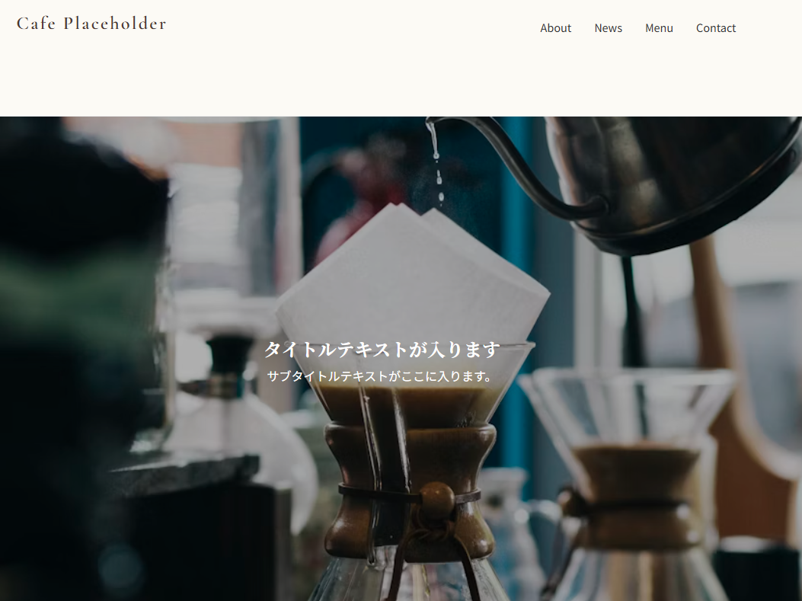

# ☕️ Cafe Placeholder - コンセプトカフェ特設サイト

落ち着いた雰囲気のカフェをイメージした、モダンでレスポンシブなシングルページ・ウェブサイトです。

## 🌟 主な機能とこだわり
このプロジェクトでは、ユーザー体験（UX）を高めるための以下の機能を実装しています。

* **ヒーロスライドショー**: フェードイン・アウトで切り替わるメインビジュアル。
* **動的な営業状態表示**: JavaScriptで現在時刻を取得し、「営業中/準備中」をリアルタイムに判定。
* **インタラクティブ・メニュー**: メニュー項目にホバーすると、料理のイメージ写真が丸いフレームで浮き上がる演出。
* **レスポンシブ・デザイン**: ハンバーガーメニューを搭載し、iPhone（Safari）などのスマートフォンでも快適に閲覧可能。
* **アクセシビリティ**: `aria-label` や適切な `alt` 属性、セマンティックなHTMLタグ（header, main, section, footer）を採用。
* **お問い合わせフォーム**: 送信ボタン押下後のサンクスメッセージ表示機能をシミュレート。

## 📸 スクリーンショット


## 🛠 使用技術（Tech Stack）
* **HTML5**: セマンティックな構造化
* **CSS3**: Flexboxを用いたレイアウト、CSS変数、メディアクエリ
* **JavaScript (Vanilla JS)**: 外部ライブラリを使わず、軽量なコードでアニメーションとロジックを実装
* **Google Fonts**: 'Noto Serif JP', 'Cormorant Garamond' 等のWebフォント使用
* **Unsplash**: 高品質なフリー画像素材の活用

## 📂 ファイル構成
```text
.
├── index.html      # メインのHTML構造
├── style.css       # サイト全体のデザイン・アニメーション
├── script.js       # スライドショー、営業判定、メニュー演出、フォーム制御
├── hero-view.png   # メインビジュアルのスクリーンショット
└── README.md       # この説明書
